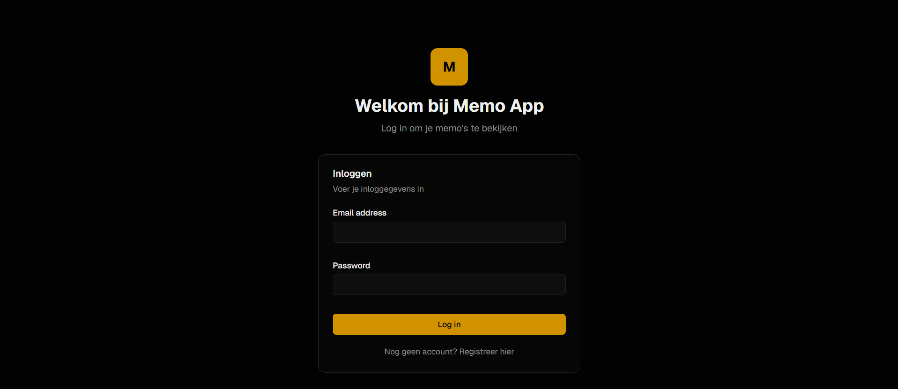
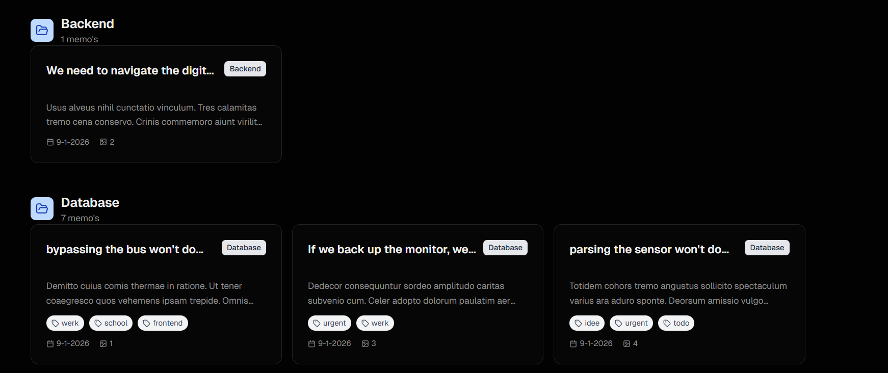
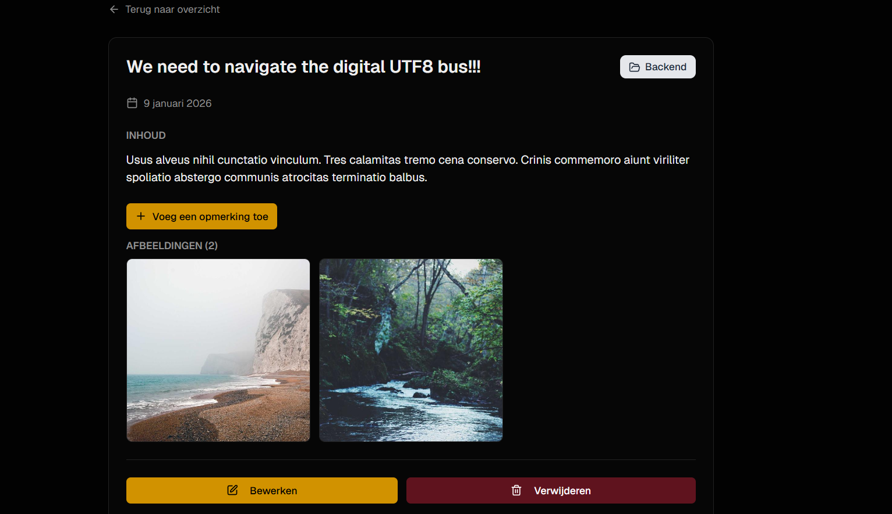

De Memo App is een webapplicatie waarmee gebruikers eenvoudig notities (memo’s) kunnen beheren op een gestructureerde manier.
Gebruikers kunnen memo’s aanmaken, organiseren met mappen en tags, en extra informatie toevoegen zoals commentaar en foto’s.

Deze applicatie werd ontwikkeld als project binnen mijn opleiding Graduaat Programmeren en focust op full-stack development met moderne technologieën.

✅ Authenticatie

Gebruikers kunnen:

Registreren met een eigen account

Inloggen om toegang te krijgen tot hun persoonlijke memo’s

📂 Mappen en Tags

Om memo’s overzichtelijk te houden kunnen gebruikers:

Mappen aanmaken en beheren

Tags toevoegen om memo’s sneller terug te vinden

🗒️ Memo’s beheren

Een gebruiker kan:

Nieuwe memo’s aanmaken

Memo’s bewerken wanneer nodig

Memo’s organiseren binnen mappen en tags

💬 Comments en Foto’s toevoegen

Elke memo kan uitgebreid worden met:

Extra comments/notities

Afbeeldingen ter ondersteuning of verduidelijking

Afbeeldingen worden veilig opgeslagen via Supabase Storage.

⚙️ Gebruikte technologieën
Technologie	Toepassing
React / Next.js	Front-end interface
TypeScript	Type safety en betere codekwaliteit
Prisma ORM	Databasebeheer en queries
Supabase	Gegevensopslag en authenticatie
Supabase Storage	Opslag van afbeeldingen

📸 Screenshots

